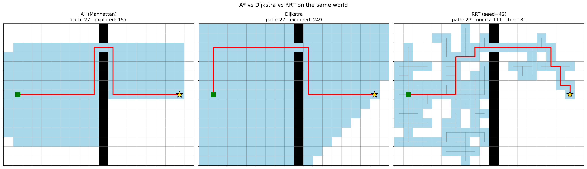

# motion-planning-playground

Interactive visualizations of 2D motion planning algorithms. Explore how A*, Dijkstra, RRT, and RRT* solve grid-world problems with obstacles, and compare their performance quantitatively.



All three planners find a 27-step path around the wall. A* explores 157 cells using its heuristic to focus toward the goal. Dijkstra explores 249 cells with no heuristic. RRT builds a random tree of 111 nodes in 181 iterations, biased 5% toward the goal.

## Algorithms

- **A***: grid-based optimal shortest path with heuristic guidance (implemented)
- **Dijkstra**: uniform-cost graph search, implemented as A* with a zero heuristic (implemented)
- **RRT**: sampling-based tree exploration for continuous spaces (implemented)
- **RRT***: asymptotically optimal variant with rewiring (planned)

## Requirements

Python 3.10+ with matplotlib and numpy.

## Setup

```bash
python3 -m venv .venv
source .venv/bin/activate
pip install -r requirements.txt
```

## Examples

Run A* on the default wall world:

```bash
python examples/run_astar_demo.py
```

Compare A*, Dijkstra, and RRT on the same world:

```bash
python examples/run_comparison_demo.py
```

Run RRT alone on the wall world:

```bash
python examples/run_rrt_demo.py
```

Regenerate the README image:

```bash
python examples/generate_readme_image.py
```

## Structure

```text
src/
  grid_world.py       2D grid environment with obstacles, start, goal
  astar.py            A* and Dijkstra implementations
  visualize.py        matplotlib rendering
examples/
  run_astar_demo.py             single-algorithm demo
  run_comparison_demo.py        side-by-side A* vs Dijkstra
  generate_readme_image.py      docs image generator
```
